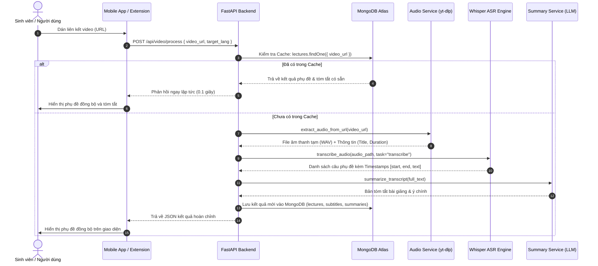
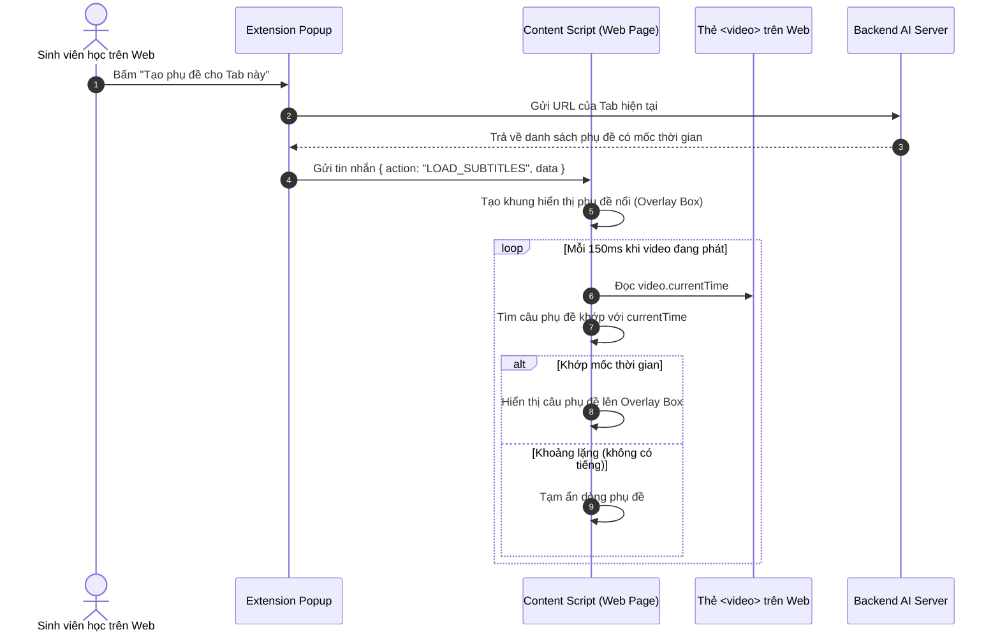

# TÀI LIỆU THIẾT KẾ KIẾN TRÚC HỆ THỐNG & CƠ SỞ DỮ LIỆU
## Học phần: Phát triển Ứng dụng | Đại học Lạc Hồng

> **Đề tài:** Ứng dụng tự động tóm tắt và đồng bộ phụ đề đa ngôn ngữ cho video bài giảng  
> **Sinh viên thực hiện:** Võ Trần Minh Thắng & Vũ Đình Khánh Long  
> **Giáo viên hướng dẫn:** ThS. Phan Mạnh Thường  

---

## 1. KIẾN TRÚC PHÂN TẦNG (LAYERED ARCHITECTURE)

Hệ thống được thiết kế theo mô hình kiến trúc phân tầng chuẩn công nghiệp, đảm bảo tính mở rộng và dễ bảo trì:

```
┌────────────────────────────────────────────────────────────────────────────┐
│ 1. TẦNG TRÌNH DIỄN (PRESENTATION LAYER - CLIENTS)                          │
│    - Mobile App: React Native (Cross-platform Android / iOS)               │
│    - Browser Extension: Chrome Extension Manifest V3 (Content Script, UI)  │
└─────────────────────────────────────┬──────────────────────────────────────┘
                                      │ HTTP REST API / WebSocket
┌─────────────────────────────────────▼──────────────────────────────────────┐
│ 2. TẦNG ĐIỀU PHỐI & API GATEWAY (APPLICATION LAYER)                        │
│    - Framework: FastAPI (Python) - Asynchronous I/O                        │
│    - Xác thực (Auth), CORS Middleware, Định tuyến API (Routing)             │
│    - Quản lý bộ đệm Cache phản hồi nhanh                                   │
└─────────────────────────────────────┬──────────────────────────────────────┘
                                      │ Service Calls
┌─────────────────────────────────────▼──────────────────────────────────────┐
│ 3. TẦNG DỊCH VỤ THÔNG MINH (AI & SERVICE LAYER)                            │
│    - Audio Service: yt-dlp + FFmpeg (Bóc tách âm thanh không tải video)    │
│    - ASR Service: faster-whisper (CTranslate2 Engine - Sinh Timestamps)    │
│    - Translation Service: Neural Machine Translation (Đa ngôn ngữ)         │
│    - Summary Service: Large Language Model (Gemini / Local LLM)            │
└─────────────────────────────────────┬──────────────────────────────────────┘
                                      │ ODM (Motor Async Driver)
┌─────────────────────────────────────▼──────────────────────────────────────┐
│ 4. TẦNG LƯU TRỮ DỮ LIỆU (DATA PERSISTENCE LAYER)                           │
│    - MongoDB Atlas / Local MongoDB: Users, Lectures, Subtitles, Summaries  │
│    - Local File Cache: Lưu trữ tạm file WAV khi đang xử lý                │
└────────────────────────────────────────────────────────────────────────────┘
```

---

## 2. SƠ ĐỒ TUẦN TỰ TƯƠNG TÁC (SEQUENCE DIAGRAMS)

### 2.1. Luồng 1: Xử lý video qua liên kết URL (YouTube / Drive / LMS)



### 2.2. Luồng 2: Tiện ích trình duyệt bắt âm thanh Tab & Hiển thị Lớp phủ (Overlay)



---

## 3. THIẾT KẾ CƠ SỞ DỮ LIỆU CHI TIẾT (DATA DICTIONARY)

Hệ thống sử dụng MongoDB làm cơ sở dữ liệu phi quan hệ (NoSQL) với 4 Collection chính:

### 3.1. Collection: `users`
Lưu trữ thông tin tài khoản của sinh viên và giảng viên.

| Tên trường (Field) | Kiểu dữ liệu | Ràng buộc (Constraint) | Mô tả chi tiết |
| :--- | :--- | :--- | :--- |
| `_id` | ObjectId | Primary Key | Khóa chính tự sinh |
| `name` | String | Required | Họ và tên người dùng |
| `email` | String | Required, **Unique Index** | Email đăng nhập |
| `password_hash` | String | Required | Mật khẩu băm (bcrypt) |
| `role` | String | Enum: `["student", "lecturer"]` | Vai trò người dùng |
| `created_at` | DateTime | Default: `now()` | Thời điểm tạo tài khoản |

### 3.2. Collection: `lectures`
Lưu trữ thông tin metadata của video bài giảng và quản lý bộ nhớ đệm (Cache).

| Tên trường (Field) | Kiểu dữ liệu | Ràng buộc (Constraint) | Mô tả chi tiết |
| :--- | :--- | :--- | :--- |
| `_id` | ObjectId | Primary Key | Khóa chính bài giảng |
| `video_url` | String | Required, **Unique Index** | Đường dẫn bài giảng (để check cache) |
| `title` | String | Required | Tiêu đề của video bài giảng |
| `duration_seconds` | Double | Default: 0 | Tổng thời lượng video (giây) |
| `source_type` | String | Enum: `["youtube", "drive", "lms", "mic"]` | Nguồn video |
| `detected_language`| String | Default: `"en"` | Ngôn ngữ AI tự phát hiện (`vi`, `en`, `ja`...) |
| `status` | String | Enum: `["processing", "completed", "failed"]`| Trạng thái xử lý |
| `created_at` | DateTime | **Index**, Default: `now()` | Thời gian xử lý video |

### 3.3. Collection: `subtitles`
Lưu trữ phụ đề chi tiết kèm mốc thời gian chính xác từng mili-giây.

| Tên trường (Field) | Kiểu dữ liệu | Ràng buộc (Constraint) | Mô tả chi tiết |
| :--- | :--- | :--- | :--- |
| `_id` | ObjectId | Primary Key | Khóa chính |
| `lecture_id` | ObjectId | **Index**, Ref: `lectures._id` | Khóa ngoại trỏ đến bài giảng |
| `language` | String | Required (ví dụ: `vi`, `en`) | Ngôn ngữ của bộ phụ đề |
| `segments` | Array of Objects | Required | Danh sách các đoạn phụ đề |
| `segments.id` | Integer | Required | Số thứ tự câu phụ đề |
| `segments.start` | Double | Required | Giây bắt đầu nói |
| `segments.end` | Double | Required | Giây kết thúc nói |
| `segments.text` | String | Required | Nội dung văn bản câu nói |

### 3.4. Collection: `summaries`
Lưu trữ nội dung tóm tắt học tập được sinh ra bởi LLM.

| Tên trường (Field) | Kiểu dữ liệu | Ràng buộc (Constraint) | Mô tả chi tiết |
| :--- | :--- | :--- | :--- |
| `_id` | ObjectId | Primary Key | Khóa chính bản tóm tắt |
| `lecture_id` | ObjectId | **Index**, Ref: `lectures._id` | Khóa ngoại trỏ đến bài giảng |
| `overview` | String | Required | Đoạn văn tóm tắt tổng quan |
| `key_points` | Array of Strings | Required | Các ý cốt lõi, khái niệm, công thức |
| `quiz` | Array of Objects | Optional | Bộ câu hỏi trắc nghiệm tự ôn tập |
| `created_at` | DateTime | Default: `now()` | Thời gian tạo tóm tắt |
