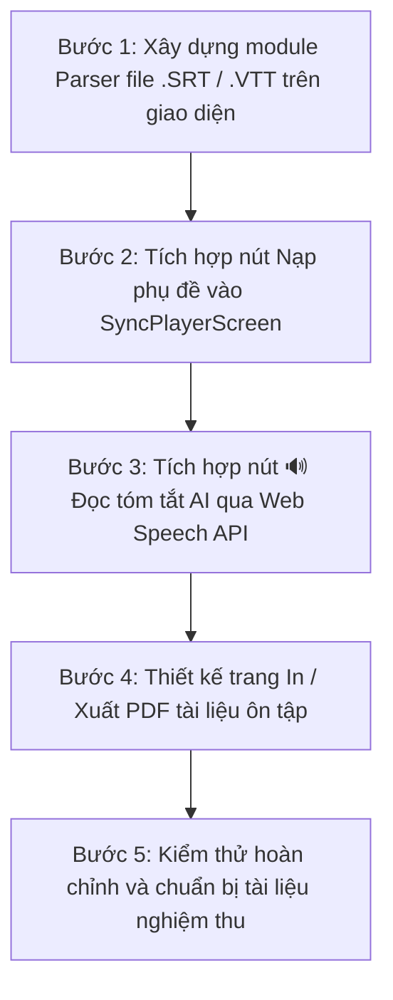

# KẾ HOẠCH PHÁT TRIỂN HỆ THỐNG - GIAI ĐOẠN 2

* **Đề tài:** Ứng dụng tự động tóm tắt và đồng bộ phụ đề đa ngôn ngữ cho video bài giảng
* **Đơn vị:** Trường Đại học Lạc Hồng (LHU) - Ngành Công nghệ Thông tin
* **Giảng viên hướng dẫn:** ThS. Phan Mạnh Thường
* **Sinh viên thực hiện:** Võ Trần Minh Thắng & Trịnh Khánh Long
* **Phiên bản:** Tuần 6 (Giai đoạn 2)

---

## 📌 PHẦN 1: TỔNG KẾT THÀNH QUẢ GIAI ĐOẠN 1 ĐÃ HOÀN THÀNH

Trước khi bước vào Giai đoạn 2, toàn bộ nền tảng cốt lõi của Giai đoạn 1 đã được xây dựng và kiểm thử hoạt động 100% ổn định:
1. **Chuyển đổi hoàn toàn sang Cloud Firestore (`ptud-dt012`):** Thay thế MongoDB, lưu trữ vĩnh viễn dữ liệu và cơ chế Cache $O(1)$ tức thì 0.01 giây.
2. **Đồng bộ thời gian thực 2 chiều:** Kết nối YouTube Iframe Player API & HTML5 Video/Audio thật, loại bỏ nút Play giả.
3. **Sửa logic chấm điểm Trắc nghiệm (`QuizCard.js`):** Chuẩn hóa đáp án `A/B/C/D`, chấm điểm chính xác và hiển thị lời giải thích chi tiết.
4. **Cơ chế AI Fallback (`summary_service.py`):** Tự động chuyển đổi `gemini-2.5-flash` sang `gemini-2.0-flash` khi chạm hạn mức ngày, tránh lỗi 429.
5. **Thanh tìm kiếm phụ đề thông minh (`SyncPlayerScreen.js`):** Ô `🔍 Tìm câu / thuật ngữ...` lọc mốc thời gian `[mm:ss]` và click tua video chuẩn xác.
6. **Lớp phủ phụ đề nổi trên video & Nút `[CC]`:** Chữ nổi đè lên video phong cách YouTube/Netflix, có nút bật/tắt, không che nút điều khiển.
7. **Bảo toàn giọng nói gốc & Song ngữ 2 chiều:** Whisper luôn ghi nhận nguyên văn lời người nói (`original_text`), hiển thị song ngữ Việt - Anh linh hoạt.
8. **Tùy chọn Bật/Tắt Quiz (`HomeScreen.js`):** Tắt Quiz giúp xử lý video siêu tốc, bật Quiz giúp ôn tập bài giảng.

---

## 🚀 PHẦN 2: CÁC TÍNH NĂNG TRỌNG TÂM CỦA GIAI ĐOẠN 2

Dựa trên yêu cầu thực tế từ sổ tay ghi chú và hướng phát triển đề tài, Giai đoạn 2 tập trung vào **3 tính năng an toàn, thiết thực và tạo điểm nhấn cao**:

### 1. 📂 Nạp file phụ đề có sẵn (.SRT / .VTT) từ máy tính (Trọng tâm cốt lõi)
* **Ý nghĩa thực tế:**
  * Sinh viên học các khóa học từ Coursera, edX, YouTube thường đã có sẵn file phụ đề `.srt` hoặc `.vtt`.
  * Thay vì phải đợi AI Whisper bóc tách lại từ đầu, người dùng chỉ cần bấm nút **"Nạp file phụ đề"** và chọn file từ máy tính.
* **Quy trình xử lý kỹ thuật:**
  1. Người dùng bấm nút `📂 Nạp file phụ đề` trên giao diện phát video.
  2. Module Parser phía Client (JavaScript) đọc nội dung file văn bản, phân tích mốc thời gian:
     ```
     1
     00:01:20,000 --> 00:01:24,500
     Chào mừng các bạn đến với bài học hôm nay.
     ```
  3. Tự động chuyển đổi thành mảng JSON chuẩn:
     `{ start: 80.0, end: 84.5, text: "Chào mừng các bạn...", original_text: "..." }`
  4. Nạp thẳng vào danh sách phụ đề của video hiện tại trong 0.1 giây.
  5. Cung cấp tùy chọn **Dịch phụ đề vừa nạp sang ngôn ngữ khác** qua API translation của hệ thống.
* **Mức độ an toàn:** **100% An toàn**, không tốn tài nguyên GPU, không ảnh hưởng cơ sở dữ liệu.

---

### 2. 🔊 Đọc tóm tắt bài giảng bằng giọng nói AI (Text-to-Speech - TTS)
* **Ý nghĩa thực tế:**
  * Hỗ trợ sinh viên ôn tập bài giảng rảnh tay (vừa nghe vừa làm việc khác hoặc nghỉ ngơi), hỗ trợ người khiếm thị.
  * Tạo ấn tượng công nghệ vượt trội khi báo cáo thuyết trình trước hội đồng bảo vệ đồ án.
* **Quy trình xử lý kỹ thuật:**
  * Tận dụng trực tiếp **Web Speech API (`window.speechSynthesis`)** có sẵn trên tất cả các trình duyệt hiện đại (Chrome, Edge) và điện thoại di động.
  * Nhận diện ngôn ngữ bài tóm tắt để chọn giọng đọc tiếng Việt (`vi-VN`) hoặc tiếng Anh (`en-US`) tự nhiên.
  * Cung cấp thanh điều khiển âm thanh: Nút **Phát (Play)**, **Tạm dừng (Pause)**, **Dừng hẳn (Stop)**.
* **Mức độ an toàn:** **100% An toàn**, không cần cài đặt thêm thư viện nặng vào backend, 0% độ trễ.

---

### 3. 🖨️ Xuất tài liệu tóm tắt & trắc nghiệm ra bản In / PDF khổ A4
* **Ý nghĩa thực tế:**
  * Giúp sinh viên lưu lại đề cương tóm tắt bài học và bộ câu hỏi trắc nghiệm ôn thi dưới dạng file PDF hoặc in ra giấy A4.
* **Quy trình xử lý kỹ thuật:**
  * Thiết kế mẫu dàn trang in ấn chuyên nghiệp (Print Layout): Logo đề tài, tiêu đề bài giảng, thời lượng, bảng tổng quan, các điểm cốt lõi, danh sách thuật ngữ và bộ câu hỏi trắc nghiệm kèm đáp án.
  * Kích hoạt qua lệnh in chuẩn `window.print()` của trình duyệt.
* **Mức độ an toàn:** **100% An toàn**, thuần túy là giao diện người dùng.

---

## 📋 PHẦN 3: ĐỊNH HƯỚNG BÁO CÁO CHO CÁC MỤC PHỨC TẠP

Nhóm thống nhất phương án xử lý đối với các mục kỹ thuật mở rộng:

1. **Về cơ chế cắt 10-15s nhận diện ngôn ngữ trước (Whisper 2-pass):**
   * *Kết luận:* **Không áp dụng.**
   * *Lý do:* Whisper đã tự động nhận diện ngôn ngữ audio cực chuẩn ngay trong luồng xử lý đầu tiên. Việc tự cắt 15s rồi chạy AI 2 lần sẽ làm thời gian người dùng phải chờ đợi tăng gấp đôi.
2. **Về Tiện ích mở rộng Chrome Extension:**
   * *Kết luận:* **Đưa vào chương "Hướng phát triển tương lai" trong cuốn Báo cáo Đồ án.**
   * *Lý do:* Chrome Extension yêu cầu cấu hình Manifest V3, đăng ký Google Web Store và cấp quyền capture tab độc lập. Việc trình bày sơ đồ kiến trúc mở rộng sang Chrome Extension trong báo cáo sẽ giúp đồ án thể hiện tầm nhìn phát triển dài hạn mà nhóm không chịu rủi ro về mặt kỹ thuật khi demo.

---

## 🛠️ THỨ TỰ TRIỂN KHAI KHI BẮT ĐẦU GIAI ĐOẠN 2


